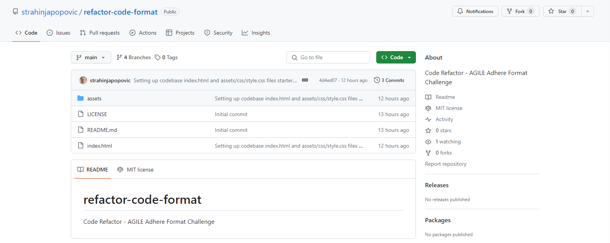
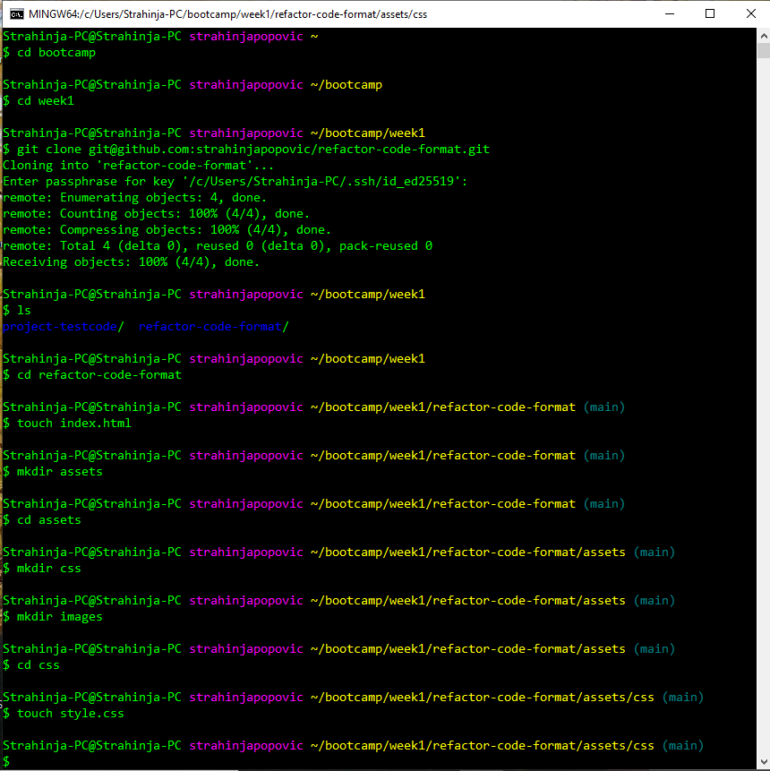
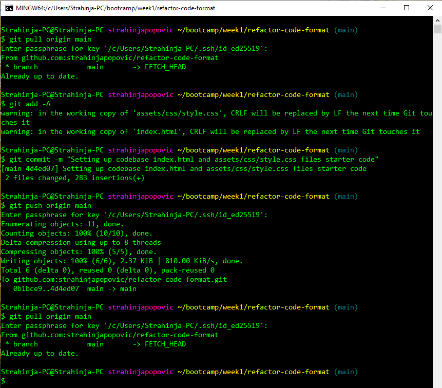
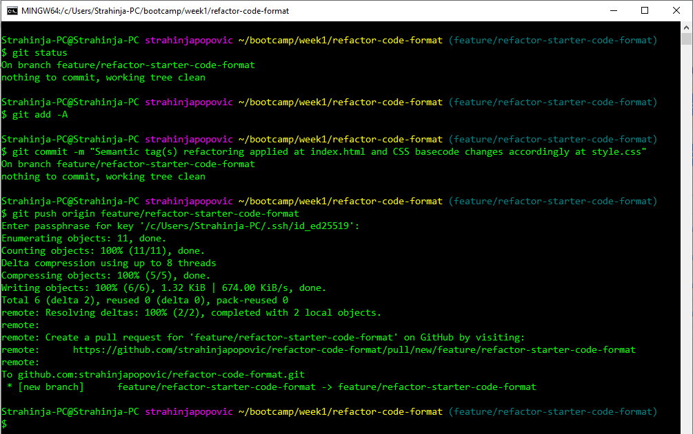
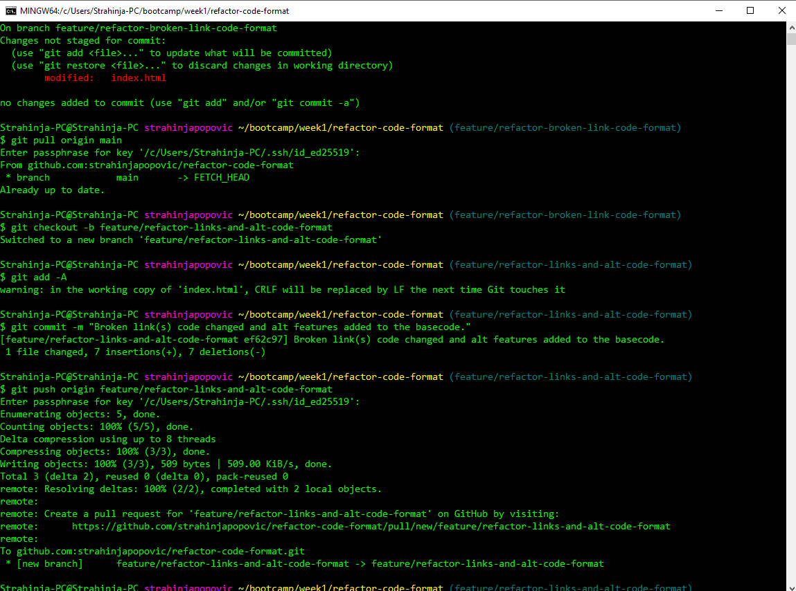
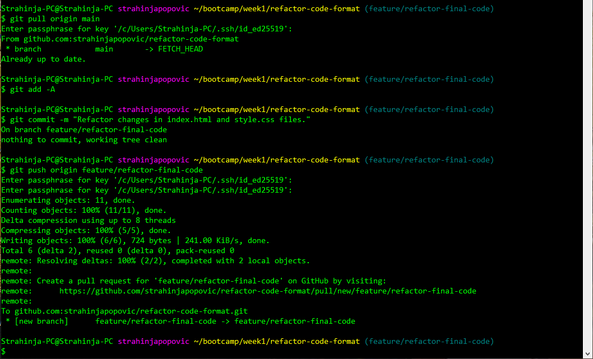
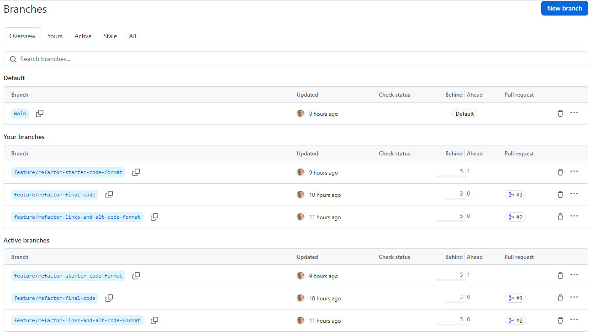
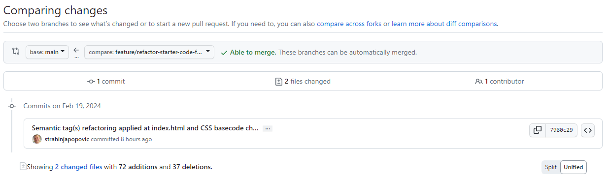

# Code Base Refactor - AGILE Adhere Format Challenge

## Description

This project would help anyone to understand good practice of coding. It involves all major web technologies combined together to provide best possible outcomes. HTML blocks describing main shape of the website, CSS adds rendering attributes and properties. Git provides source code version control management system and coolaboration. It contains notes on HTML, CSS and Git.

## Installation

N / A

## Usage

- New repository created at GitHub account strahinjapopovic as refactor-code-format.

- Clone repositories from GitHub to local HDD and assign files and folders inside repository under bootcamp/week1/new-repo local directory with additional files like index.html and style.css.

- Push changes to GitHub repo refactor-code-format.

- Apply semantic tags changes in index.html and style.css files in new branch refactor-starter-code-format. 

>***Semantic tags :***
    >- &lt;aside&gt;&lt;/aside&gt;
    >- &lt;form&gt;&lt;/form&gt;
    >- &lt;header&gt;&lt;/header&gt;
    >- &lt;nav&gt;&lt;/nav&gt;
    >- &lt;section&gt;&lt;/section&gt;
    >- &lt;table&gt;&lt;/table&gt;
    >- &lt;footer&gt;&lt;/footer&gt;

- Description image changes and broken links repair in new branch refactor-links-and-alt-code-format. 

- Some of the last changes applied in the new branch fefactor-final-code refactor-final-code. 

- After finalizing all feature branches and code alterations proceed to closing all Pull Requesrs PR.

>***All feature brances are marged with main branch and then closed.***

>***Each pull request PR marging the main branch and other feature branch.***

 

## Credits

N/A

## License

Please refer to the MIT LICENSE in the repo.